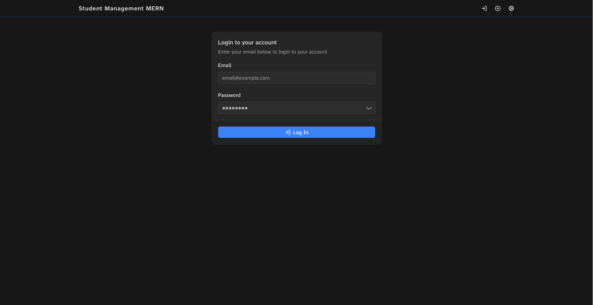
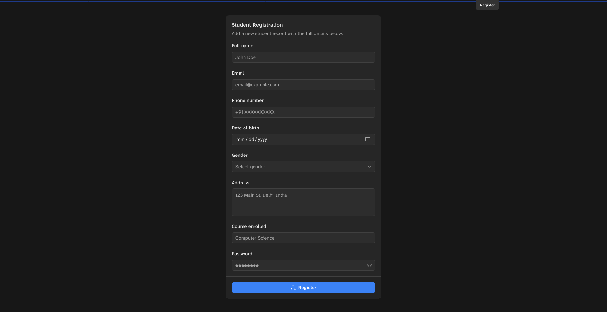
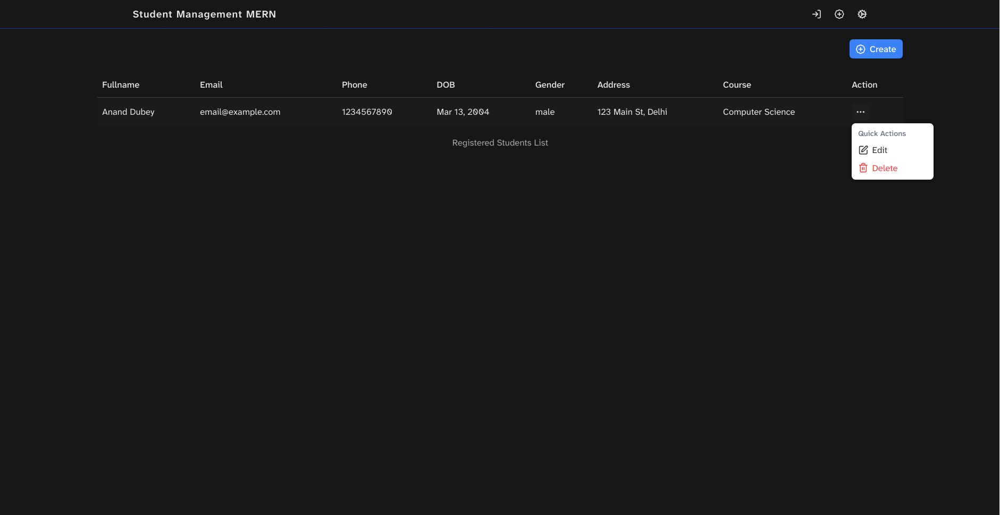

# Student Management MERN

## Tech Stack

### Client

- React 19
- TypeScript
- Vite
- React Router
- React Hook Form
- Zod
- Tailwind CSS
- shadcn/radix-ui components
- ky for API requests
- Web Crypto API for client-side AES-GCM encryption

### Server

- Node.js
- Express 5
- TypeScript
- tsx for local development
- MongoDB
- Mongoose
- dotenv
- Node crypto module for password hashing, lookup hashing, and backend AES-GCM encryption

## Project Structure

```text
.
├── client/   # React Vite frontend
└── server/   # Express API backend
```

## Setup

### 1. Clone and Install

Install dependencies for both apps:

```bash
cd client
npm install

cd ../server
npm install
```

If you prefer Bun (I did):

```bash
cd client
bun install

cd ../server
bun install
```

### 2. Configure Server Environment

Create `server/.env`:

```env
PORT=4000
MONGO_URI=mongodb://127.0.0.1:27017
FRONTEND_URL=http://localhost:5173

CLIENT_ENCRYPTION_KEY=replace-with-the-same-value-used-by-the-client
SERVER_ENCRYPTION_KEY=replace-with-a-strong-server-only-secret
LOOKUP_HASH_KEY=replace-with-a-strong-lookup-hash-secret
```

`MONGO_URI` is required. The server connects with database name `merntask`.

### 3. Configure Client Environment

Create `client/.env`:

```env
VITE_API_URL=http://localhost:4000/api
VITE_CLIENT_ENCRYPTION_KEY=replace-with-the-same-value-used-by-the-server-client-key
```

`VITE_CLIENT_ENCRYPTION_KEY` and `CLIENT_ENCRYPTION_KEY` must match because the server decrypts the first encryption layer for validation and login.

### 4. Run the Apps

Start the backend:

```bash
cd server
npm run dev
```

Start the frontend in another terminal:

```bash
cd client
npm run dev
```

Open the Vite URL shown in the terminal, usually:

```text
http://localhost:5173
```

## Useful Scripts

### Client

```bash
npm run dev      # Start Vite dev server
npm run build    # Type-check and build frontend
npm run lint     # Run ESLint
npm run preview  # Preview production build
```

### Server

```bash
npm run dev        # Start Express server with tsx
npm run typecheck  # Run TypeScript type-check
```

## Encryption Flow

The app uses two levels of encryption for student data.

### Create or Update

1. The frontend encrypts student form fields with AES-GCM using `VITE_CLIENT_ENCRYPTION_KEY`.
2. The encrypted payload is sent to the backend.
3. The backend decrypts the client layer only for validation, password hashing, and email lookup hashing.
4. The backend stores the student fields as client-encrypted values wrapped inside a second AES-GCM encryption layer using `SERVER_ENCRYPTION_KEY`.
5. MongoDB stores the backend-encrypted values.

### Fetch

1. The backend reads encrypted records from MongoDB.
2. The backend decrypts only its own storage layer.
3. The response sent to the frontend still contains client-encrypted field values.
4. The frontend decrypts the remaining client layer before displaying the student data.

### Login and Lookup

Emails are encrypted like the other student fields, so the backend cannot query MongoDB by plaintext email. To support login and duplicate checks, the server stores an `emailHash` generated with HMAC-SHA256 using `LOOKUP_HASH_KEY`.

Passwords are not encrypted for storage. They are hashed with PBKDF2 and stored as `passwordHash`.

## Screenshots

#### Login Page


#### Register Page


### Student Lists

